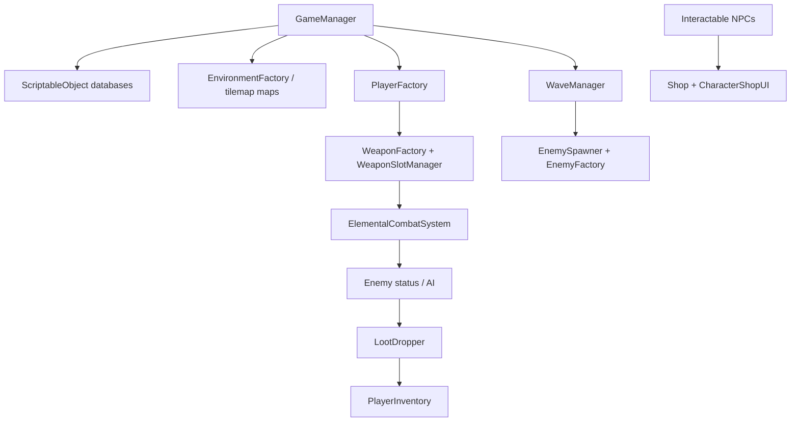

# Swarmed Worm

**Portfolio demo** of a 2D top-down horde-survival shooter built in Unity.

Play as an armed worm: shop in the lobby, walk through a door onto a beach combat map, and fight waves with a data-driven weapon loadout. Hits can apply **fire, ice, poison, electric, or void** status effects.

> This is a student / internship portfolio piece, not a commercial release.  
> Original work by **Chase Wilson**. Not affiliated with Team17 or the *Worms* series.

## What this shows

The interesting part is the **gameplay architecture**, not a finished art pass.

| System | What to look at |
| --- | --- |
| Session orchestration | `Assets/Scripts/Game/GameManager.cs` |
| Data-driven content | `Assets/Scripts/Data/` + `Assets/GameData/*Database.asset` |
| Combat + elements | `Assets/Scripts/Weapons/` especially `ElementalCombatSystem.cs` |
| Waves + spawning | `WaveManager.cs`, `EnemySpawner.cs` |
| Enemy AI | `Enemy.cs`, `EnemyAI.cs`, melee / ranged / burrower / summon types |
| Inventory + shop | `PlayerInventory.cs`, `CharacterShopUI.cs` |
| Custom inspectors | `Assets/Editor/` |

Content (weapons, enemies, waves, players, NPCs) lives in ScriptableObject databases. Runtime code clones those definitions through factories instead of hard-coding stats in scenes.

## Tech

- **Engine:** Unity 6 (`6000.0.38f1`)
- **Language:** C#
- **Rendering:** Universal Render Pipeline (2D)
- **UI:** uGUI + TextMesh Pro
- **Physics:** Unity 2D (`Rigidbody2D`, overlap queries)

## Features

- **Hub and combat maps** — lobby with NPC shopkeepers; doors hot-swap the environment without loading a second Unity scene
- **Waves** — kill-count and survival objectives, with hub mode that disables combat
- **Weapons** — projectile (pierce, bounce, homing, explosions), melee arcs, summons
- **Elemental combat** — fire burn, ice slow/freeze, poison spread, electric chain, void black holes
- **Enemies** — melee, ranged, burrower, summoner, plus a trilobite behavior on the beach
- **Inventory** — five weapon slots, item/artifact grids, credits, loot pickups
- **Shop** — buy characters and weapons from interactable NPCs
- **Player** — WASD move, mouse aim independent of facing, Space to burrow (invulnerability window + cooldown)
- **Editor tools** — custom inspectors for the databases so content can be tuned without hunting scene objects

Prototype sprites and a few AI-assisted images are placeholders so systems can be played. They are not a final art direction.

## Architecture



**Suggested reading order**

1. `GameManager` — boot, environment swap, player spawn
2. `Player` / `WeaponBase` — input, aim, fire
3. `WaveManager` + `EnemySpawner` — combat loop
4. `SceneDoorTrigger` — hub ↔ beach
5. `Assets/GameData/*.asset` — the actual content tables

Catalogs (`WeaponCatalog`, `EnemyCatalog`, …) are static registries so UI, loot, and spawners can resolve the same databases without dragging references everywhere.

## Controls

| Action | Input |
| --- | --- |
| Move | WASD / arrow keys |
| Aim | Mouse |
| Shoot | Left mouse |
| Burrow | Space |
| Interact / shop | E |
| Inventory | I (Esc to close) |
| Next wave | F (when prompted) |
| Restart after death | R |
| Return to lobby after death | L |

## Run the demo

1. Install **Unity Hub** and editor **6000.0.38f1** (or a close Unity 6 version).
2. Clone this repository.
3. In Unity Hub: **Add** → open this folder (`SwarmedWormDemo`).
4. Open scene `Assets/Scenes/Beach.unity`.
5. Press Play.

The first load regenerates `Library/` (not committed). That is expected.

Unity Personal is enough. This repo does not include a built player; it is source for the Editor.

## Repository layout

```
Assets/
  Scripts/          Gameplay code, grouped by system
  Editor/           Custom inspectors for databases
  GameData/         ScriptableObject databases, sprites, prefabs
  Scenes/           Beach.unity (boot scene)
  Tilesets/         2D map tiles
  Settings/         URP / 2D renderer
Packages/           Unity package manifest
ProjectSettings/    Company, product, build scenes
```

Generated folders (`Library/`, `Temp/`, `Logs/`, `obj/`, `UserSettings/`) are gitignored.

## License and copyright

This is a **portfolio demo**. Copyright © 2026 Chase Wilson (chasewilsonbusiness@gmail.com).

| What | License |
| --- | --- |
| Original C# (`Assets/Scripts`, `Assets/Editor`) | [MIT](LICENSE) |
| Original game art and content | [All rights reserved](LICENSE-ASSETS) |
| Unity Engine and Unity packages | Unity's terms — see [NOTICE.md](NOTICE.md) |
| Liberation Sans (TMP default font) | SIL Open Font License 1.1 |

You may clone and run the project to evaluate the code. Do not reuse the art in another game without permission.

## Status

Playable vertical slice: lobby, beach waves, weapons, elements, inventory, and shop.

Not a shippable product. No audio pass, no production animation set, no save system, no multiplayer.

## Author

**Chase Wilson**  
[chasewilsonbusiness@gmail.com](mailto:chasewilsonbusiness@gmail.com)  
[github.com/iDesole](https://github.com/iDesole)
