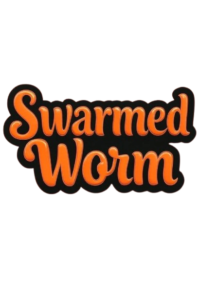
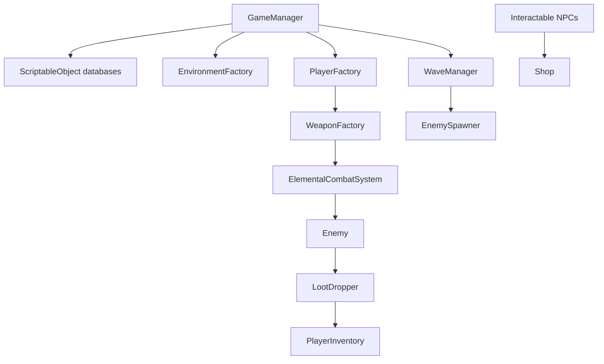

# Swarmed Worm



2D top-down horde-survival shooter. Unity 6 (`6000.0.38f1`), C#, URP 2D.

Lobby with NPC shops, beach combat map, wave objectives, data-driven weapons, and elemental status effects (fire, ice, poison, electric, void).

## Requirements

- [Unity Hub](https://unity.com/download)
- Unity **6000.0.38f1** (Unity 6)

## Run

1. Clone this repository.
2. Add the folder in Unity Hub and open it.
3. Open `Assets/Scenes/Beach.unity`.
4. Press Play.

`Library/` is generated on first open and is not in source control.

## Controls

| Action | Input |
| --- | --- |
| Move | WASD / arrows |
| Aim | Mouse |
| Fire | Left mouse |
| Burrow | Space |
| Interact | E |
| Inventory | I (Esc closes) |
| Next wave | F |
| Restart | R |
| Return to lobby | L |

## Systems

| Area | Code |
| --- | --- |
| Session | `Assets/Scripts/Game/GameManager.cs` |
| Content tables | `Assets/Scripts/Data/`, `Assets/GameData/*Database.asset` |
| Combat | `Assets/Scripts/Weapons/` |
| Waves | `WaveManager.cs`, `EnemySpawner.cs` |
| Enemies | `Assets/Scripts/Enemy/` |
| Inventory / shop | `PlayerInventory.cs`, `CharacterShopUI.cs` |
| Editors | `Assets/Editor/` |

Weapons, enemies, waves, players, and NPCs are ScriptableObject databases. Runtime code clones definitions through factories.



## Layout

```
Assets/Scripts/     Gameplay
Assets/Editor/      Database inspectors
Assets/GameData/    Databases, sprites, prefabs
Assets/Scenes/      Beach.unity
Assets/Tilesets/    Map tiles
Packages/           Unity packages
ProjectSettings/    Player and build settings
```

## License

Copyright © 2026 Chase Wilson.

| Material | Terms |
| --- | --- |
| Source (`Assets/Scripts`, `Assets/Editor`) | [MIT](LICENSE) |
| Art and game content | [All rights reserved](LICENSE-ASSETS) |
| Unity Engine and packages | Unity terms — [NOTICE.md](NOTICE.md) |
| Liberation Sans | SIL OFL 1.1 |

## Contact

Chase Wilson  
[chasewilsonbusiness@gmail.com](mailto:chasewilsonbusiness@gmail.com)  
[github.com/iDesole](https://github.com/iDesole)
